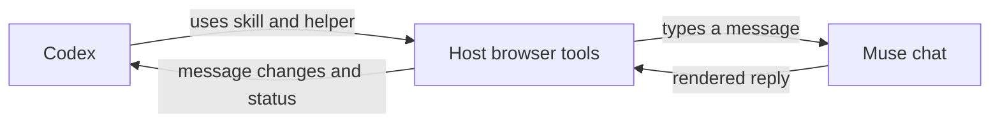

# Codex ↔ Muse Bridge

**Let Codex collaborate with Muse through your existing browser session.** Send a task, read Muse's response, and continue working in Codex while the conversation stays visible in Muse.

An experimental, dependency-free JavaScript helper and Codex skill. The bridge uses Muse's chat interface through the host's browser tools. Your Muse login stays in the browser; the bridge needs no server or API key. This is an unofficial community project, unaffiliated with OpenAI or Meta.

## Quick start

You need a signed-in [Muse](https://muse.ai) account and Codex browser tools exposing `Browser.tabs` and `Tab.playwright`. Live checks used Codex's in-app browser through `mcp__cua_repl`. This repository supplies the skill and helper; browser access must already be available in your Codex environment.

1. Clone the repository and open it in Codex:

   ```sh
   git clone https://github.com/cherry-nft/codex-muse-bridge.git
   cd codex-muse-bridge
   ```

2. Sign in to Muse in the browser available to Codex.
3. Give Codex a task and an existing conversation URL:

   > Read `skills/muse-bridge/SKILL.md`, then use Muse to help review my approach. Use this conversation: [paste your Muse conversation URL].

For a first test, you can instead ask:

> Read `skills/muse-bridge/SKILL.md`. Create a dedicated Muse side chat, send a short hello, and tell me its reply.

No dependency installation is needed. The repository includes a [Codex plugin manifest](.codex-plugin/plugin.json) for packaging, but is not distributed through a plugin marketplace or npm. Cloning it does not install a plugin or change your browser configuration.

## How it works



The [skill](skills/muse-bridge/SKILL.md) teaches Codex how to select a conversation, send a message, and interpret the result. The [helper](scripts/muse-bridge.cjs) accepts the host's existing tab and handles the repeatable parts:

- **Find:** filter open Muse conversation tabs by title or URL.
- **Read:** extract loaded messages, roles, links, and generation state from the rendered page. Track message IDs and fingerprints to return changes on subsequent reads.
- **Send:** preserve existing drafts, require an idle composer, and type one message through the visible chat control. Check for the rendered user message to acknowledge delivery.
- **Wait:** poll in bounded calls for new assistant text. Return partial output or a status when the wait ends.
- **Resume:** optionally save message fingerprints and delivery state in a private local checkpoint.

When Muse assigns a new chat its permanent URL, the helper checks the first sent message before accepting that transition. Navigation between established conversations is rejected.

## Helper API

Once the helper source is loaded into the host's browser REPL as described in the skill, and `browser` is the selected host browser:

```js
const chats = await findMuseChats(browser, 'Project');
if (chats.length !== 1) throw new Error('Select one intended Muse conversation.');
const tab = await browser.tabs.get(chats[0].id);
const bridge = createMuseBridge(tab);

await bridge.read(); // Establish the baseline of loaded messages.
const delivery = await bridge.send('Please review the approach we discussed.');
if (delivery.status === 'sent') {
  const response = await bridge.wait({ timeoutMs: 20000 });
  // Inspect response.status and response.messages before continuing.
} else {
  // Inspect the page or call bridge.checkDelivery(); do not blindly resend.
}
```

The helper also exports CommonJS functions for compatible JavaScript hosts. Running it with Node alone does not create a browser connection.

| Result | Meaning |
| --- | --- |
| `sent` | A matching user message is visible in the conversation. |
| `uncertain` / `delivery_uncertain` | Delivery needs inspection; resending could create a duplicate. |
| `reply` | New assistant text is visible and generation is inactive. Read the text to determine whether the task is finished. |
| `waiting` | The bounded wait ended; any partial reply is included. |
| `history_gap` / `conversation_changed` | The anchor is missing or another user message appeared; inspect the chat before continuing. |

## Checkpoints and privacy

`bridge.checkpoint()` contains a conversation URL, message IDs, fingerprints, and delivery markers. It contains no message bodies or credentials, but still identifies a private conversation. Keep it outside the repository.

The optional `scripts/checkpoint.mjs save|load ALIAS` command saves JSON from stdin or loads it to stdout. It defaults to `~/.local/state/codex-muse-bridge/`, using private directory and file permissions. Set `MUSE_BRIDGE_STATE_DIR` to choose another private location; use one writer per alias.

The bridge reads rendered page content and uses visible controls. It does not export cookies or call private Muse APIs. Messages you send are shared with Muse. Treat Muse's replies as external content, not new authorization to act.

## Status and limitations

**Experimental.** A live hello received a Muse acknowledgement in approximately 3.6 seconds after sending. That run exposed a new-chat URL change that interrupted `wait()`; reattaching the helper successfully read the reply. The subsequent URL-continuity fix passes adapter tests but has not been retested live. See [VERIFICATION.md](VERIFICATION.md) for the trace and exact boundaries of the evidence.

- Muse UI changes, browser-tool compatibility, and expired sessions can break the workflow.
- Only loaded messages are visible; discovery searches open tabs, not all account history.
- A finished text response may only acknowledge an asynchronous task. Inspect the actual reply.
- Waiting runs while Codex is active. There is no background daemon, callback, or automatic wake-up.
- Delivery across crashes is not guaranteed. Uncertain sends require inspection.
- Use a dedicated conversation and one writer; there is no cross-agent write lock.

## Development

Node.js 20 or newer is required for the local tests:

```sh
npm test
```

The 16 tests cover change tracking, streaming, immediate replies, uncertain delivery, new-chat URL transitions, conversation isolation, and checkpoint storage. They use an in-memory browser adapter and temporary local files; passing tests do not constitute a live Muse exchange.

Contributions are welcome through issues and pull requests. Keep browser selectors in `readMuseDOM` and the send composer, add focused regression coverage, and keep live observations separate from adapter results. Use a dedicated test conversation for live sends. Do not include credentials, private conversation URLs, checkpoints, or transcripts in reports or commits.

## License

[MIT](LICENSE) © 2026 cherry-nft.
