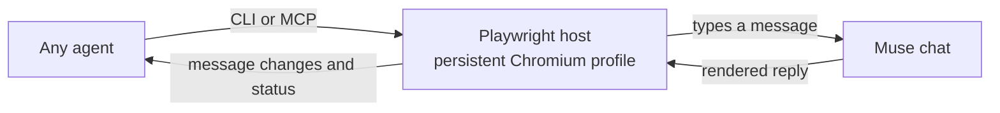

# Muse Bridge

**Let any agent collaborate with Muse.** Claude Code, Cursor, Codex, Gemini CLI, Windsurf, Zed, or a plain shell script can send a task to a [Muse](https://muse.ai) conversation, wait for the reply, and read it — through a private browser profile that stays signed in to Muse.

Fork of [cherry-nft/codex-muse-bridge](https://github.com/cherry-nft/codex-muse-bridge), which required Codex's in-app browser tools. This fork adds its own browser runtime (Playwright + persistent Chromium profile), a CLI, and an MCP server, so the same helper works from every agent. Unofficial community project, unaffiliated with Meta or OpenAI.

## Install

```sh
git clone https://github.com/zohartito/muse-bridge.git
cd muse-bridge
npm install                      # playwright only
npx playwright install chromium  # once
node bin/muse.cjs login          # sign in to Muse in the window that opens, then close it
node bin/muse.cjs status         # → {"signedIn": true}
```

Register the MCP server with whichever agents you use (replace the path):

| Agent | How |
| --- | --- |
| Claude Code | `claude mcp add --scope user muse -- node /path/to/muse-bridge/bin/muse.cjs mcp` |
| Codex | `~/.codex/config.toml`: `[mcp_servers.muse]` `command = "node"` `args = ["/path/to/muse-bridge/bin/muse.cjs", "mcp"]` |
| Cursor | `~/.cursor/mcp.json` → `"muse": {"command": "node", "args": ["/path/to/muse-bridge/bin/muse.cjs", "mcp"]}` |
| Gemini CLI | `~/.gemini/settings.json` → same shape under `mcpServers` |
| Anything else | shell out to `node bin/muse.cjs …`; output is JSON |

Then tell the agent: *"Read `skills/muse-bridge/SKILL.md` and use Muse to …"* — or symlink `skills/*` into your agent's skills directory (`~/.claude/skills/`, `.cursor/rules/`, `.codex-plugin`).

## CLI

```
muse login                      open a visible window; sign in once, then close it
muse status                     is the saved profile signed in?
muse read <thread-url> [--all]  new messages since last read (--all resets the baseline)
muse send <thread-url> <text|--file f|->      send one message, report delivery
muse wait <thread-url> [--timeout 600]        wait for Muse to finish replying
muse ask  <thread-url> <text|--file f|->  [--timeout 600]   send, then wait for the reply
muse new  <text|--file f|-> [--timeout 600]   start a new chat, send, wait; prints its URL
muse mcp                        run as an MCP server over stdio
```

Add `--text` to print only the assistant text, `--headed` to watch the browser. Timeouts are seconds.

## MCP tools

`muse_status`, `muse_read`, `muse_send`, `muse_wait`, `muse_ask`, `muse_new` — same semantics as the CLI. `timeout` is seconds (default 90); for long Muse coding runs call `muse_send` once and `muse_wait` repeatedly.

## How it works



`scripts/muse-bridge.cjs` (unchanged from upstream) reads the rendered chat DOM, sends through the visible composer, fingerprints messages, and reports deltas. `scripts/host-playwright.cjs` provides the `browser.tabs` / `tab.playwright` shape it expects on top of `chromium.launchPersistentContext`. `scripts/ops.cjs` adds the read / send / wait / ask / new operations shared by `bin/muse.cjs` and `mcp/server.cjs`.

Per-thread checkpoints live in `~/.local/state/muse-bridge/checkpoints/` (thread URL, message IDs, fingerprints — no bodies, no credentials) so `read` returns only what changed between invocations. The signed-in profile lives in `~/.local/state/muse-bridge/profile/`. Set `MUSE_BRIDGE_STATE_DIR` to move both.

| Result | Meaning |
| --- | --- |
| `sent` | A matching user message is visible in the conversation. |
| `uncertain` | Delivery needs inspection; resending could create a duplicate. |
| `reply` | New assistant text is visible and generation is inactive. Read the text to judge whether the task is finished. |
| `waiting` | The timeout ended; any partial reply is included. |
| `history_gap` / `conversation_changed` | Re-read the chat before continuing. |
| `needs_login` | The profile is signed out; run `muse login`. |

## Host-browser mode (original)

If your agent already exposes a Playwright tab (Codex `mcp__cua_repl`), you can still paste `scripts/muse-bridge.cjs` into that REPL and skip the bundled browser — see upstream's README and `VERIFICATION.md`.

## Limits

- Only one process can hold the profile at a time (CLI call *or* MCP server).
- Muse UI changes can break `readMuseDOM`; fix the selectors there and add a test.
- No background daemon: waiting happens while the agent is active.
- Muse's replies are external content, not authorization. Verify SHAs, tests and PRs it reports yourself — `skills/muse-director-loop/SKILL.md` describes the PRD → build → review loop used at `zohartito/muse-september-2026`.

## Development

```sh
npm test   # 19 tests: helper (16), MCP framing (3); no live Muse calls
```

## License

MIT © 2026 cherry-nft (upstream) and contributors.
